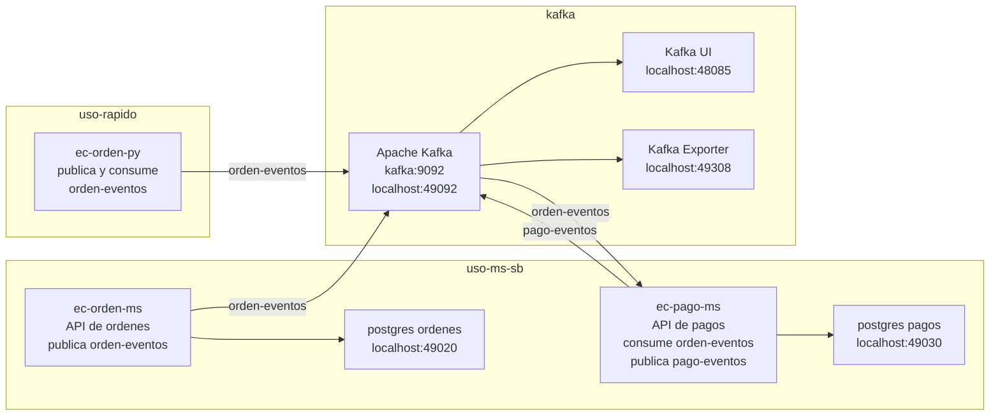

# Taller: Aplicaciones de Microservicios Orientados a Eventos

## 1. Titulo

Implementacion de un flujo orientado a eventos con Apache Kafka, Python y microservicios Spring Boot para un caso de e-commerce.

## 2. Alcance del taller

Este taller trabaja unicamente con estos modulos del repositorio `lambdalab`:

- `kafka`
- `uso-rapido/ec-orden-py`
- `uso-ms-sb/ec-orden-ms`
- `uso-ms-sb/ec-pago-ms`

El orden de trabajo sera progresivo, porque los alumnos primero necesitan ubicarse en Docker antes de integrar microservicios:

1. Primero se levanta Kafka con Docker Compose.
2. Luego se entra al contenedor Kafka para trabajar en Bash:

```powershell
docker compose -f kafka/compose.yml exec kafka bash
```

3. Dentro del contenedor Kafka se crean topics y se prueban producer/consumer manuales.
4. Despues se usa `ec-orden-py` como practica rapida para entender el patron producer/consumer.
5. Al final se ejecuta el flujo completo con microservicios:

```text
ec-orden-ms -> orden-eventos -> ec-pago-ms -> pago-eventos
```

## 3. Objetivo

Implementar y validar una aplicacion de microservicios orientada a eventos usando Apache Kafka, mediante tres niveles de practica:

- pruebas manuales con producer y consumer dentro del contenedor Kafka
- pruebas rapidas con producer y consumer en Python
- integracion entre microservicios Spring Boot, donde un servicio publica eventos de ordenes y otro los consume para generar eventos de pagos

## 4. Herramientas utilizadas

- Apache Kafka
- Docker Compose
- Kafka UI
- Python
- Spring Boot
- Java 17
- Maven Wrapper
- PostgreSQL
- PowerShell
- Navegador web

## 5. Arquitectura del taller

Este taller usa solo una parte de la arquitectura LambdaLab v2026-1. Aqui se muestran unicamente los componentes necesarios para trabajar eventos con Kafka, Python y microservicios Spring Boot.

Para ver la arquitectura completa del laboratorio, revisa la [documentacion general de LambdaLab](https://261bigdata.github.io/lambdalab).



Lectura del diagrama:

- `kafka` es el broker central donde se publican y consumen eventos.
- `ec-orden-py` permite practicar rapido el patron producer/consumer.
- `ec-orden-ms` expone una API para crear ordenes y publica `orden.creada`.
- `ec-pago-ms` consume `orden.creada`, simula el pago y publica un evento de pago.
- Los microservicios no tienen puerto fijo en la arquitectura; en esta practica se usan puertos locales solo por el perfil `dev`.
- Kafka UI permite inspeccionar topics, mensajes y consumer groups desde el navegador.

## 6. Flujo de trabajo del taller

El flujo del taller va de lo simple a lo integrado:

1. El alumno levanta el stack Kafka desde `kafka/compose.yml`.
2. El alumno entra al contenedor Kafka con Bash usando `docker compose -f kafka/compose.yml exec kafka bash`.
3. Dentro del contenedor Kafka, el alumno crea topics y prueba producer/consumer manuales.
4. Luego ejecuta `uso-rapido/ec-orden-py` para publicar y consumir eventos desde Python.
5. Finalmente levanta `ec-orden-ms` y `ec-pago-ms` para validar el flujo completo de microservicios orientados a eventos.

En este taller se usa el stack `kafka/`, que es el entorno liviano sin CDC/Debezium. Otros modulos del laboratorio, como PySpark, CDC u observabilidad, se revisan en la documentacion completa de LambdaLab.

## 7. Entorno de trabajo

Ubicate en la raiz del repositorio:

```powershell
cd C:\261bigdata\lambdalab
```

### 7.1 Instalacion minima en Windows

Para este taller se necesita Docker Desktop desde el inicio, porque Kafka, PostgreSQL, Python y los microservicios se levantan con contenedores.

Instala Docker Desktop desde:

[Docker Desktop](https://www.docker.com/products/docker-desktop)

En Windows, Docker Compose se instala junto con Docker Desktop. Para verificar que Docker esta funcionando, abre PowerShell y ejecuta:

```powershell
docker ps
```

Si el comando responde con una tabla de contenedores, Docker esta listo. Si muestra error de conexion, abre Docker Desktop y espera a que el motor termine de iniciar.

Java 17 y Maven se usan en el paso final para ejecutar los microservicios Spring Boot localmente, desde tu IDE o con `mvn spring-boot:run`. En otros escenarios se puede construir la aplicacion dentro de Docker, pero ese modo `prod` no forma parte del alcance operativo de este taller.

Instalar Java 17 con Chocolatey:

```powershell
choco install temurin17 -y
```

Tambien puedes descargar Java 17 desde:

[Adoptium Temurin](https://adoptium.net)

Instalar Maven 3.x con Chocolatey:

```powershell
choco install maven -y
```

Si no tienes Chocolatey, ejecuta PowerShell como administrador y pega este comando:

```powershell
Set-ExecutionPolicy Bypass -Scope Process -Force; [System.Net.ServicePointManager]::SecurityProtocol = [System.Net.ServicePointManager]::SecurityProtocol -bor 3072; iex ((New-Object System.Net.WebClient).DownloadString('https://community.chocolatey.org/install.ps1'))
```

Uso local de Maven: ubicate en la carpeta donde esta el `pom.xml` del microservicio y ejecuta:

```powershell
mvn spring-boot:run
```

### 7.2 Como leer los comandos Docker de este taller

En este taller se usan dos tipos de terminal:

| Terminal | Donde se ejecuta | Como reconocerla |
|---|---|---|
| PowerShell | En Windows, fuera de Docker | Los comandos usan `docker compose`, `cd`, `Invoke-RestMethod` |
| Bash del contenedor | Dentro del contenedor Kafka | Los comandos usan rutas como `/opt/kafka/bin/...` |

Cuando veas un bloque `powershell`, ejecutalo en PowerShell:

```powershell
docker compose -f kafka/compose.yml up -d
```

Cuando veas un bloque `bash`, primero debes entrar al contenedor Kafka:

```powershell
docker compose -f kafka/compose.yml exec kafka bash
```

Despues de entrar, ya puedes ejecutar comandos internos de Kafka:

```bash
/opt/kafka/bin/kafka-topics.sh --list --bootstrap-server kafka:9092
```

Comandos Docker Compose que se repetiran:

| Comando | Para que sirve |
|---|---|
| `docker compose -f <archivo> up -d` | Levanta servicios en segundo plano |
| `docker compose -f <archivo> up -d --build` | Construye imagenes y levanta servicios |
| `docker compose -f <archivo> ps` | Muestra si los contenedores estan activos |
| `docker compose -f <archivo> exec <servicio> <comando>` | Ejecuta un comando dentro de un contenedor |
| `docker compose -f <archivo> logs -f <servicio>` | Muestra logs en tiempo real |
| `docker compose -f <archivo> down` | Detiene y elimina los contenedores del stack |

> Importante: Docker debe estar abierto antes de ejecutar los comandos. Si Docker Desktop no esta iniciado, `docker compose` no podra conectarse al motor Docker.

Servicios principales:

| Componente | Valor |
|---|---|
| Kafka broker desde Docker | `kafka:9092` |
| Kafka broker desde el host | `localhost:49092` |
| Kafka UI | `http://localhost:48085` |
| Red Docker compartida | `lambdalab-kafka-net` |
| Orden MS | aplicacion Spring Boot `ec-orden-ms` en perfil `dev` |
| Pago MS | aplicacion Spring Boot `ec-pago-ms` en perfil `dev` |

### 7.3 Perfiles y puertos de los microservicios

La arquitectura del taller no fija puertos para los microservicios. En un escenario de despliegue, el puerto de cada instancia puede ser dinamico y la exposicion se resuelve con componentes de plataforma, gateway o descubrimiento de servicios.

En este taller se usa el perfil `dev` para ejecutar los microservicios desde Maven o desde el IDE. Por eso aparecen puertos locales de apoyo:

| Microservicio | Perfil usado en el taller | Puerto local de prueba |
|---|---|---|
| `ec-orden-ms` | `dev` | `http://localhost:49021` |
| `ec-pago-ms` | `dev` | `http://localhost:49031` |

El perfil `prod` no forma parte del alcance operativo del taller. Puede existir en los archivos del proyecto como referencia para despliegue, pero no se desarrolla ni se evalua en esta practica.

Topics del taller:

| Topic | Uso |
|---|---|
| `orden-eventos` | Eventos publicados cuando se crea una orden |
| `pago-eventos` | Eventos publicados cuando se procesa el pago |

## 8. Caso de uso final

Al final del taller se simula un flujo simple de e-commerce. No se empieza por aqui; primero se valida Kafka manualmente y luego se practica con Python.

1. `ec-orden-ms` registra una orden.
2. `ec-orden-ms` publica un evento `orden.creada` en el topic `orden-eventos`.
3. Kafka distribuye el evento.
4. `ec-pago-ms` consume `orden-eventos`.
5. `ec-pago-ms` procesa un pago simulado.
6. `ec-pago-ms` publica `pago.aprobado` o `pago.rechazado` en el topic `pago-eventos`.

## 9. Fundamento teorico breve

Ten presentes estos conceptos:

- `topic`: canal logico donde se publican mensajes.
- `producer`: aplicacion que envia eventos a Kafka.
- `consumer`: aplicacion que lee eventos desde Kafka.
- `broker`: servidor Kafka que almacena y distribuye eventos.
- `consumer group`: grupo que comparte el avance de lectura de un topic.
- `event`: registro de algo que ya ocurrio en el sistema.
- `key`: clave usada por Kafka para decidir la particion del mensaje.

## 10. Desarrollo de la practica

### 10.1 Levantar Kafka

Desde la raiz del repositorio:

```powershell
docker compose -f kafka/compose.yml up -d
```

Que hace este comando:

- lee el archivo `kafka/compose.yml`
- descarga las imagenes necesarias si no existen localmente
- crea la red Docker `lambdalab-kafka-net`
- levanta Kafka, Kafka UI y Kafka Exporter
- deja los contenedores ejecutandose en segundo plano por el uso de `-d`

Verifica los contenedores:

```powershell
docker compose -f kafka/compose.yml ps
```

Debes tener disponibles:

- `lambdalab-kafka`
- `lambdalab-kafka-ui`
- `lambdalab-kafka-exporter`

Abre Kafka UI:

```text
http://localhost:48085
```

### 10.2 Crear los topics de trabajo

Desde PowerShell, ingresa al contenedor Kafka:

```powershell
docker compose -f kafka/compose.yml exec kafka bash
```

Este comando no crea topics todavia. Solo abre una terminal Bash dentro del contenedor Kafka.

A partir de este punto, los siguientes comandos se ejecutan dentro del contenedor. Por eso aparecen como `bash`.

Crea el topic `orden-eventos`:

```bash
/opt/kafka/bin/kafka-topics.sh --create \
  --topic orden-eventos \
  --bootstrap-server kafka:9092 \
  --partitions 1 \
  --replication-factor 1
```

Crea el topic `pago-eventos`:

```bash
/opt/kafka/bin/kafka-topics.sh --create \
  --topic pago-eventos \
  --bootstrap-server kafka:9092 \
  --partitions 1 \
  --replication-factor 1
```

Lista los topics:

```bash
/opt/kafka/bin/kafka-topics.sh --list \
  --bootstrap-server kafka:9092
```

Resultado esperado:

```text
orden-eventos
pago-eventos
```

> Nota: si un topic ya existe, Kafka mostrara un mensaje de error indicando que ya fue creado. En ese caso continua con el siguiente paso.

Para salir del Bash del contenedor y volver a PowerShell:

```bash
exit
```

### 10.3 Probar producer y consumer manuales

Para esta prueba se necesitan dos terminales.

Terminal 1: desde PowerShell, entra al contenedor Kafka:

```powershell
docker compose -f kafka/compose.yml exec kafka bash
```

Luego, dentro del contenedor, ejecuta un consumer para `orden-eventos`:

```bash
/opt/kafka/bin/kafka-console-consumer.sh \
  --topic orden-eventos \
  --bootstrap-server kafka:9092 \
  --from-beginning
```

Terminal 2: desde PowerShell, entra nuevamente al contenedor Kafka:

```powershell
docker compose -f kafka/compose.yml exec kafka bash
```

Luego, dentro del contenedor, ejecuta el producer:

```bash
/opt/kafka/bin/kafka-console-producer.sh \
  --topic orden-eventos \
  --bootstrap-server kafka:9092
```

Escribe un mensaje de prueba:

```text
hola kafka
```

Verifica que el mensaje aparezca en el consumer.

### 10.4 Practica rapida con Python

El modulo `ec-orden-py` contiene un producer y un consumer simples para reforzar el flujo Kafka antes de usar Spring Boot.

Desde la raiz del repositorio, levanta el contenedor:

```powershell
docker compose -f uso-rapido/ec-orden-py/compose.yml up -d --build
```

Ejecuta el consumer:

```powershell
docker compose -f uso-rapido/ec-orden-py/compose.yml exec ec-orden-py python /app/consumer_ordenes.py
```

En otra terminal, ejecuta el producer:

```powershell
docker compose -f uso-rapido/ec-orden-py/compose.yml exec ec-orden-py python /app/producer_ordenes.py
```

El producer publica eventos continuamente en `orden-eventos`.

Ejemplo de evento:

```json
{
  "tipoEvento": "orden.creada",
  "ordenId": 321,
  "total": 180.0,
  "estado": "PENDIENTE",
  "origen": "python",
  "timestamp": 1713350000000
}
```

Verifica que:

- el producer registre mensajes con `status=published`
- el consumer registre mensajes con `status=consumed`
- Kafka UI muestre mensajes en el topic `orden-eventos`

### 10.5 Levantar el microservicio de ordenes

`ec-orden-ms` registra ordenes en PostgreSQL y publica eventos en `orden-eventos`.

En el alcance del taller se trabaja con el perfil `dev`: Docker Compose levanta solo PostgreSQL y la aplicacion Spring Boot se ejecuta localmente con Maven. El puerto `49021` corresponde a este perfil de practica, no a una regla de arquitectura ni a un despliegue `prod`.

Desde la raiz del repositorio, levanta PostgreSQL de desarrollo:

```powershell
docker compose -f uso-ms-sb/ec-orden-ms/compose-dev.yml up -d
```

Verifica el contenedor de PostgreSQL:

```powershell
docker compose -f uso-ms-sb/ec-orden-ms/compose-dev.yml ps
```

En otra terminal, ubicate en la carpeta del microservicio:

```powershell
cd C:\261bigdata\lambdalab\uso-ms-sb\ec-orden-ms
```

Ejecuta la aplicacion:

```powershell
mvn spring-boot:run
```

Prueba el endpoint:

```powershell
Invoke-RestMethod `
  -Method Post `
  -Uri "http://localhost:49021/ordenes" `
  -ContentType "application/json" `
  -Body '{"usuarioId":1,"total":100}'
```

Respuesta esperada:

```json
{
  "id": 1,
  "usuarioId": 1,
  "total": 100.0,
  "estado": "PENDIENTE"
}
```

Revisa la terminal donde esta corriendo `mvn spring-boot:run`. Ahi aparecen los logs del productor.

Busca una linea similar:

```text
service=ec-orden-ms component=producer topic=orden-eventos eventType=orden.creada status=published
```

### 10.6 Levantar el microservicio de pagos

`ec-pago-ms` consume `orden-eventos`, registra el pago en PostgreSQL y publica eventos en `pago-eventos`.

En el alcance del taller se trabaja con el perfil `dev`. El puerto `49031` corresponde a este perfil de practica; `prod` queda fuera del alcance operativo.

Desde la raiz del repositorio, levanta PostgreSQL de desarrollo:

```powershell
docker compose -f uso-ms-sb/ec-pago-ms/compose-dev.yml up -d
```

Verifica el contenedor de PostgreSQL:

```powershell
docker compose -f uso-ms-sb/ec-pago-ms/compose-dev.yml ps
```

En otra terminal, ubicate en la carpeta del microservicio:

```powershell
cd C:\261bigdata\lambdalab\uso-ms-sb\ec-pago-ms
```

Ejecuta la aplicacion:

```powershell
mvn spring-boot:run
```

Vuelve a crear una orden:

```powershell
Invoke-RestMethod `
  -Method Post `
  -Uri "http://localhost:49021/ordenes" `
  -ContentType "application/json" `
  -Body '{"usuarioId":2,"total":150}'
```

Busca en los logs de `ec-pago-ms` lineas similares:

```text
service=ec-pago-ms component=consumer topic=orden-eventos eventType=orden.creada status=consumed
service=ec-pago-ms component=processor ordenId=<id-generado> estadoPago=APROBADO status=processed
service=ec-pago-ms component=producer topic=pago-eventos eventType=pago.aprobado status=published
```

> El pago es simulado. Por eso el evento puede ser `pago.aprobado` o `pago.rechazado`.

### 10.7 Verificar eventos desde Kafka UI

Abre:

```text
http://localhost:48085
```

Verifica:

- el topic `orden-eventos` contiene eventos `orden.creada`
- el topic `pago-eventos` contiene eventos `pago.aprobado` o `pago.rechazado`
- el consumer group `ec-pago-ms-group` aparece asociado al consumo de `orden-eventos`

## 11. Contratos de eventos

### 11.1 Evento `orden.creada`

Topic:

```text
orden-eventos
```

Productores:

- `ec-orden-py`
- `ec-orden-ms`

Consumidor:

- `ec-pago-ms`

Payload:

```json
{
  "tipoEvento": "orden.creada",
  "ordenId": 1,
  "total": 100.0,
  "estado": "PENDIENTE",
  "origen": "ec-orden-ms",
  "timestamp": 1713350000000
}
```

Campos:

| Campo | Tipo | Descripcion |
|---|---|---|
| `tipoEvento` | string | Nombre del evento publicado |
| `ordenId` | number | Identificador de la orden |
| `total` | number | Monto total de la orden |
| `estado` | string | Estado inicial de la orden |
| `origen` | string | Servicio que publico el evento |
| `timestamp` | number | Fecha/hora en milisegundos epoch |

Key recomendada:

```text
ordenId
```

### 11.2 Evento de pago

Topic:

```text
pago-eventos
```

Productor:

- `ec-pago-ms`

Payload aprobado:

```json
{
  "tipoEvento": "pago.aprobado",
  "ordenId": 1,
  "monto": 100.0,
  "estado": "APROBADO",
  "origen": "ec-pago-ms",
  "timestamp": 1713350000000
}
```

Payload rechazado:

```json
{
  "tipoEvento": "pago.rechazado",
  "ordenId": 1,
  "monto": 100.0,
  "estado": "RECHAZADO",
  "origen": "ec-pago-ms",
  "timestamp": 1713350000000
}
```

Campos:

| Campo | Tipo | Descripcion |
|---|---|---|
| `tipoEvento` | string | `pago.aprobado` o `pago.rechazado` |
| `ordenId` | number | Orden relacionada con el pago |
| `monto` | number | Monto procesado |
| `estado` | string | Resultado del pago |
| `origen` | string | Servicio que publico el evento |
| `timestamp` | number | Fecha/hora en milisegundos epoch |

Key recomendada:

```text
ordenId
```

## 12. Evidencias a entregar

Adjunta las siguientes evidencias:

- captura de `docker compose -f kafka/compose.yml ps`
- captura de Kafka UI con los topics `orden-eventos` y `pago-eventos`
- captura del producer y consumer manual
- captura del producer y consumer de `ec-orden-py`
- captura del `POST /ordenes` en `ec-orden-ms`
- captura de logs de `ec-orden-ms` publicando `orden.creada`
- captura de logs de `ec-pago-ms` consumiendo `orden.creada`
- captura de logs de `ec-pago-ms` publicando `pago.aprobado` o `pago.rechazado`
- captura de Kafka UI mostrando mensajes en `pago-eventos`

## 13. Actividad de aprendizaje autonomo

Documenta el contrato del evento `orden.creada` en un archivo propio o en tu informe, incluyendo:

- topic
- productor
- consumidor
- campos
- tipos de datos
- ejemplo de payload
- key recomendada
- razon por la que `ordenId` es una buena clave para particionado

Luego responde:

1. Que diferencia hay entre `localhost:49092` y `kafka:9092`?
2. Que rol cumple un consumer group?
3. Por que el pago no se invoca directamente desde `ec-orden-ms`?
4. Que ventaja aporta Kafka si `ec-pago-ms` esta temporalmente detenido?

## 14. Limpieza del entorno

Cuando termines el taller, puedes detener los servicios:

```powershell
docker compose -f uso-ms-sb/ec-pago-ms/compose-dev.yml down
docker compose -f uso-ms-sb/ec-orden-ms/compose-dev.yml down
docker compose -f uso-rapido/ec-orden-py/compose.yml down
docker compose -f kafka/compose.yml down
```

Si deseas borrar tambien los volumenes de PostgreSQL y Kafka, agrega `-v` al comando correspondiente.

## 15. Cierre

Al finalizar, debes haber validado tres formas de trabajar con Kafka:

- consola directa dentro del broker
- cliente Python simple
- microservicios Spring Boot orientados a eventos

El resultado final es una arquitectura donde los servicios no se llaman directamente para completar el flujo, sino que colaboran mediante eventos publicados y consumidos en Kafka.
