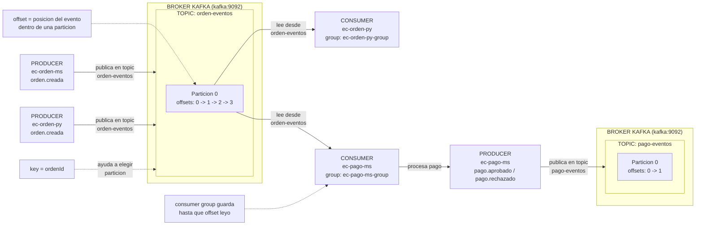

# Ingesta de eventos en tiempo real con Kafka

## Proposito de la sesion

Implementar y validar un flujo de eventos con Apache Kafka usando tres niveles de practica:

- producer y consumer manuales dentro del contenedor Kafka;
- producer y consumer en Python para pruebas rapidas;
- microservicios Spring Boot en perfil `dev`, donde ordenes publica eventos y pagos los consume.

El taller trabaja unicamente con estos modulos:

- `kafka`
- `uso-rapido/ec-orden-py`
- `uso-ms-sb/ec-orden-ms`
- `uso-ms-sb/ec-pago-ms`

## Arquitectura de la practica

```text
ec-orden-ms -> orden-eventos -> ec-pago-ms -> pago-eventos
```

En la practica manual solo se crea `orden-eventos`. El topic `pago-eventos` aparece despues, cuando `ec-pago-ms` publica el primer resultado de pago.

## Conceptos clave

- `topic`: canal logico donde se publican mensajes.
- `producer`: aplicacion que envia eventos a Kafka.
- `consumer`: aplicacion que lee eventos desde Kafka.
- `broker`: servidor Kafka que almacena y distribuye eventos.
- `partition`: division interna de un topic.
- `offset`: posicion de un evento dentro de una particion.
- `consumer group`: grupo que coordina consumidores y guarda hasta que offset leyeron.
- `key`: valor que ayuda a Kafka a decidir en que particion cae el evento.

La `key` no tiene que ser siempre una primary key relacional. Puede ser `ordenId`, `_id` de MongoDB, `deviceId`, `sessionId`, `correlationId` o un UUID generado por la aplicacion.



## Flujo de trabajo

1. Preparar entorno de trabajo.
2. Levantar Kafka.
3. Probar Kafka en consola.
4. Verificar con Kafka UI.
5. Probar Python rapido.
6. Probar microservicios Spring Boot.

## 1. Entorno de trabajo

Ubicate en la raiz del repositorio `lambdalab`. Si lo descargaste en otra ubicacion, usa tu propia ruta.

```powershell
cd C:\261bigdata\lambdalab
```

Verifica Docker:

```powershell
docker ps
```

Para el paso de microservicios se usa Java 17 y Maven local:

```powershell
java -version
mvn -v
```

Si necesitas instalar con Chocolatey:

```powershell
choco install temurin17 -y
choco install maven -y
```

## 2. Levantar Kafka

Desde la raiz del repositorio:

```powershell
docker compose -f kafka/compose.yml up -d
docker compose -f kafka/compose.yml ps
```

Servicios esperados:

- `lambdalab-kafka`
- `lambdalab-kafka-ui`
- `lambdalab-kafka-exporter`

## 3. Kafka en consola

Entra al contenedor Kafka:

```powershell
docker compose -f kafka/compose.yml exec kafka bash
```

Crea solo el topic manual `orden-eventos`:

```bash
/opt/kafka/bin/kafka-topics.sh --create \
  --topic orden-eventos \
  --bootstrap-server kafka:9092 \
  --partitions 1 \
  --replication-factor 1
```

Lista topics:

```bash
/opt/kafka/bin/kafka-topics.sh --list \
  --bootstrap-server kafka:9092
```

Resultado esperado en esta etapa:

```text
orden-eventos
```

### Producer y consumer manuales

Terminal 1:

```powershell
docker compose -f kafka/compose.yml exec kafka bash
```

```bash
/opt/kafka/bin/kafka-console-consumer.sh \
  --topic orden-eventos \
  --bootstrap-server kafka:9092 \
  --from-beginning
```

Terminal 2:

```powershell
docker compose -f kafka/compose.yml exec kafka bash
```

```bash
/opt/kafka/bin/kafka-console-producer.sh \
  --topic orden-eventos \
  --bootstrap-server kafka:9092
```

Escribe un mensaje:

```text
hola kafka
```

El consumer manual debe mostrar el mensaje.

Si solo hiciste la practica manual y quieres limpiar todo:

```powershell
docker compose -f kafka/compose.yml down -v
```

Si continuaras con Python y microservicios, no ejecutes ese comando todavia.

## 4. Kafka UI

Abre:

```text
http://localhost:48085
```

Verifica:

- cluster `lambdalab`;
- topic `orden-eventos`;
- mensajes manuales;
- columnas `partition` y `offset`.

Los offsets tambien se observan en `Consumers`, donde Kafka UI muestra el avance del consumer group y el lag.

## 5. Python rapido

Levanta el contenedor:

```powershell
docker compose -f uso-rapido/ec-orden-py/compose.yml up -d --build
```

Ejecuta el consumer:

```powershell
docker compose -f uso-rapido/ec-orden-py/compose.yml exec ec-orden-py python /app/consumer_ordenes.py
```

En otra terminal, ejecuta el producer:

```powershell
docker compose -f uso-rapido/ec-orden-py/compose.yml exec ec-orden-py python /app/producer_ordenes.py
```

El consumer Python muestra `topic`, `partition`, `offset`, `origen`, `estado`, `total` y `payload`. Si llega un mensaje manual no JSON, no debe caerse: lo marca como `invalid` y muestra `rawPayload`.

Ejemplo de evento JSON:

```json
{
  "tipoEvento": "orden.creada",
  "ordenId": 321,
  "total": 180.0,
  "estado": "PENDIENTE",
  "origen": "python",
  "timestamp": 1713350000000
}
```

## 6. Microservicios Spring Boot

El taller usa perfil `dev`. Docker Compose levanta solo PostgreSQL y la aplicacion se ejecuta localmente con Maven. El perfil `prod` no forma parte del alcance operativo de esta sesion.

### 6.1 Ordenes como producer

Levanta PostgreSQL:

```powershell
docker compose -f uso-ms-sb/ec-orden-ms/compose-dev.yml up -d
docker compose -f uso-ms-sb/ec-orden-ms/compose-dev.yml ps
```

Prueba la DB:

```powershell
docker exec -it lambdalab-postgres-ec-orden-ms-dev psql -U ecom -d db_ec_orden_ms -c "SELECT current_database();"
docker exec -it lambdalab-postgres-ec-orden-ms-dev psql -U ecom -d db_ec_orden_ms -c "\dt"
```

Ejecuta la aplicacion:

```powershell
cd C:\261bigdata\lambdalab\uso-ms-sb\ec-orden-ms
mvn spring-boot:run
```

Crea una orden:

```powershell
Invoke-RestMethod `
  -Method Post `
  -Uri "http://localhost:49021/ordenes" `
  -ContentType "application/json" `
  -Body '{"usuarioId":1,"total":100}'
```

Consulta datos:

```powershell
docker exec -it lambdalab-postgres-ec-orden-ms-dev psql -U ecom -d db_ec_orden_ms -c "\dt"
docker exec -it lambdalab-postgres-ec-orden-ms-dev psql -U ecom -d db_ec_orden_ms -c "SELECT * FROM ordenes;"
```

Busca en logs:

```text
service=ec-orden-ms component=producer topic=orden-eventos eventType=orden.creada status=published
```

### 6.2 Pagos como consumer y producer

Levanta PostgreSQL:

```powershell
docker compose -f uso-ms-sb/ec-pago-ms/compose-dev.yml up -d
docker compose -f uso-ms-sb/ec-pago-ms/compose-dev.yml ps
```

Prueba la DB:

```powershell
docker exec -it lambdalab-postgres-ec-pago-ms-dev psql -U ecom -d db_ec_pago_ms -c "SELECT current_database();"
docker exec -it lambdalab-postgres-ec-pago-ms-dev psql -U ecom -d db_ec_pago_ms -c "\dt"
```

Ejecuta la aplicacion:

```powershell
cd C:\261bigdata\lambdalab\uso-ms-sb\ec-pago-ms
mvn spring-boot:run
```

Crea otra orden para disparar el flujo:

```powershell
Invoke-RestMethod `
  -Method Post `
  -Uri "http://localhost:49021/ordenes" `
  -ContentType "application/json" `
  -Body '{"usuarioId":2,"total":150}'
```

Busca en logs:

```text
service=ec-pago-ms component=consumer topic=orden-eventos eventType=orden.creada status=consumed
service=ec-pago-ms component=processor ordenId=<id-generado> estadoPago=APROBADO status=processed
service=ec-pago-ms component=producer topic=pago-eventos eventType=pago.aprobado status=published
```

Consulta datos:

```powershell
docker exec -it lambdalab-postgres-ec-pago-ms-dev psql -U ecom -d db_ec_pago_ms -c "\dt"
docker exec -it lambdalab-postgres-ec-pago-ms-dev psql -U ecom -d db_ec_pago_ms -c "SELECT * FROM pagos;"
```

En Kafka UI verifica:

- `orden-eventos` con eventos `orden.creada`;
- `pago-eventos` con eventos `pago.aprobado` o `pago.rechazado`;
- consumer group `ec-pago-ms-group`.

## Contratos de eventos

### `orden.creada`

Topic: `orden-eventos`

Productores:

- `ec-orden-py`
- `ec-orden-ms`

Consumidores:

- `ec-orden-py`
- `ec-pago-ms`

```json
{
  "tipoEvento": "orden.creada",
  "ordenId": 1,
  "total": 100.0,
  "estado": "PENDIENTE",
  "origen": "ec-orden-ms",
  "timestamp": 1713350000000
}
```

### Evento de pago

Topic: `pago-eventos`

Productor:

- `ec-pago-ms`

```json
{
  "tipoEvento": "pago.aprobado",
  "ordenId": 1,
  "monto": 100.0,
  "estado": "APROBADO",
  "origen": "ec-pago-ms",
  "timestamp": 1713350000000
}
```

## Evidencias

Adjunta:

- `docker ps`;
- `docker compose -f kafka/compose.yml ps`;
- producer y consumer manual;
- Kafka UI con `orden-eventos`;
- producer y consumer Python;
- `POST /ordenes`;
- consulta `SELECT * FROM ordenes`;
- logs de `ec-orden-ms` publicando;
- logs de `ec-pago-ms` consumiendo y publicando;
- consulta `SELECT * FROM pagos`;
- Kafka UI con `pago-eventos`.

## Limpieza

```powershell
docker compose -f uso-ms-sb/ec-pago-ms/compose-dev.yml down
docker compose -f uso-ms-sb/ec-orden-ms/compose-dev.yml down
docker compose -f uso-rapido/ec-orden-py/compose.yml down
docker compose -f kafka/compose.yml down
```

Si deseas borrar volumenes:

```powershell
docker compose -f uso-ms-sb/ec-pago-ms/compose-dev.yml down -v
docker compose -f uso-ms-sb/ec-orden-ms/compose-dev.yml down -v
docker compose -f kafka/compose.yml down -v
```
