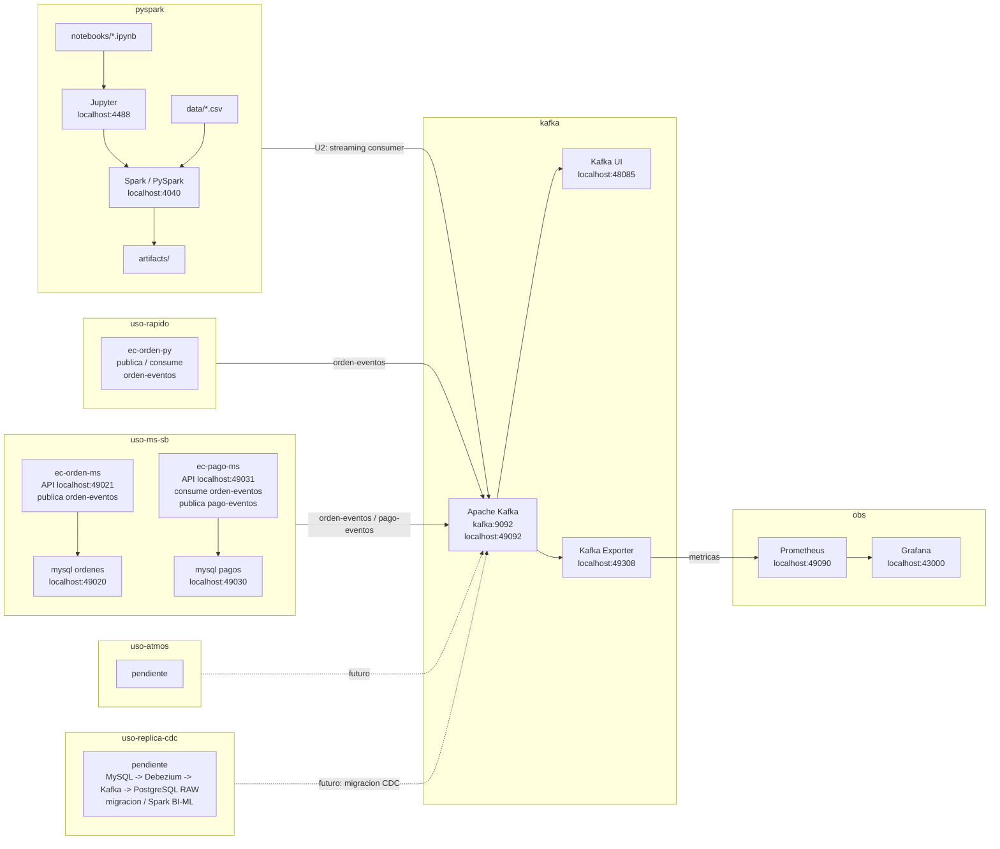

# LambdaLab

Curso practico de Big Data con Spark, Kafka, streaming, observabilidad y ML distribuido.

## Arquitectura del proyecto

## Flujo de trabajo

1. El alumno ejecuta los notebooks desde `pyspark/notebooks/` usando el laboratorio local.
2. Spark lee datos desde `pyspark/data/` y escribe resultados temporales en `pyspark/artifacts/`.
3. En los laboratorios de streaming, Spark consume eventos desde Kafka y produce resultados para BI/ML.
4. Los casos de uso publican y consumen eventos de Kafka para simular flujos reales.

## Unidades

### U1: Arquitecturas Big Data y ETL distribuido

Producto: pipeline batch en Spark con dataset listo para BI/ML.

### U2: Sistema Big Data en tiempo real

Producto: pipeline streaming en Spark para ML/BI a escala y en tiempo real.
