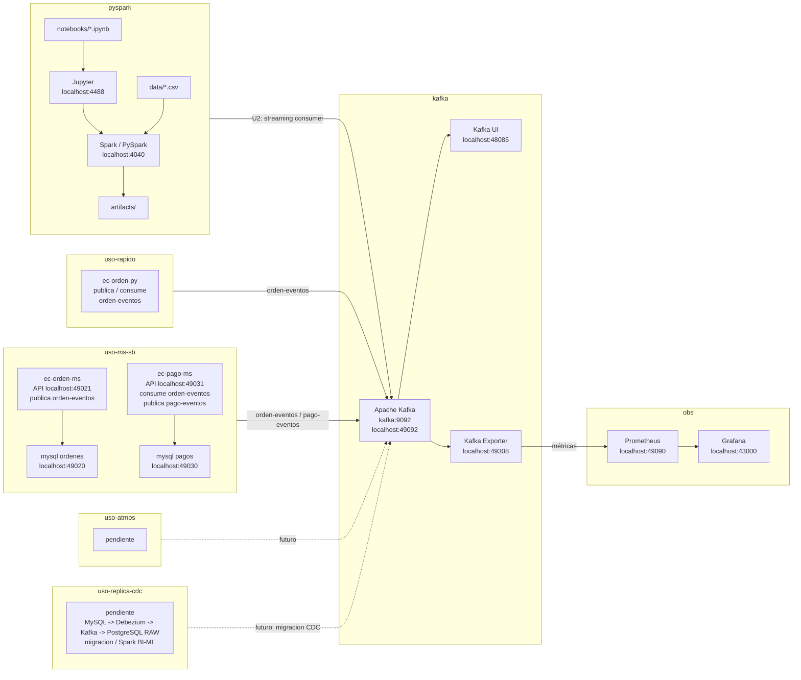

# Propuesta Sílabo 2026-2

Curso práctico de Big Data con procesamiento distribuido, streaming, observabilidad y BI/ML distribuido.

Usaremos [LambdaLab](https://github.com/261bigdata/lambdalab), un entorno
integrado de procesamiento distribuido en batch y streaming con Spark y Kafka,
[al estilo Uber](#arquitectura-uber), que permite construir pipelines de datos,
gestionar almacenamiento analítico en Parquet, aplicar observabilidad y
desarrollar soluciones de BI/ML distribuido mediante laboratorios reproducibles
basados en Docker. El entorno incluye documentación publicada y puede ser
personalizado por cada equipo para adaptarlo a su proyecto específico.

## Producto del curso

Producto del curso = Producto U3:

```text
Sistema Big Data distribuido end-to-end para procesamiento batch y streaming,
analítica/ML, observabilidad y visualización BI para la toma de decisiones.
```

Resultado esperado del curso:

Al finalizar el curso, el estudiante implementa, integra y sustenta una solución
Big Data end-to-end que combina pipelines batch distribuidos, ingesta y
procesamiento de eventos en tiempo real, analítica/ML a escala, observabilidad
técnica y una capa de visualización BI. La solución debe poder ejecutarse de
forma reproducible, mostrar evidencias de ejecución, reportar métricas técnicas
y del modelo, y demostrar valor para la toma de decisiones.

## Contenido

### U1: Arquitecturas Big Data y ETL batch distribuido

Producto U1: pipeline batch de ETL distribuido con salidas analíticas en
Parquet listas para BI/ML.

Resultado esperado U1: el estudiante construye un pipeline batch reproducible
con procesamiento distribuido, aplica transformaciones sobre datos a escala,
valida la calidad básica de los datos, organiza salidas en formatos analíticos
como Parquet y deja un dataset preparado para consumo BI/ML.

- Sesión 1: Arquitectura Big Data.
- Sesión 2:  Fundamentos PySpark: extracción, transformaciones, funciones, agrupaciones, agregaciones y RDD.
- Sesión 3: Procesamiento distribuido y carga de datos particionada en HDFS y formatos analíticos.
- Sesión 4: ML distribuido con Spark MLlib (Regresión).
- Sesión 5: Evaluación U1.

### U2: Sistema Big Data en tiempo real: streaming, operación y ML a escala

Producto U2: pipeline streaming en Spark para ML/BI a escala y en tiempo real.

Resultado esperado U2: el estudiante implementa un pipeline Big Data en tiempo
real que integra ingesta de eventos mediante Kafka, procesamiento distribuido
con Spark Structured Streaming, observabilidad y estimación de costos
operacionales. Además, entrena, evalúa, guarda y reutiliza modelos distribuidos
con Spark MLlib para inferencia batch y/o streaming, seleccionando mejores
configuraciones mediante experimentación distribuida.

- Sesión 6: Ingesta en tiempo real (Kafka).
- Sesión 7: Procesamiento en Streaming con Spark.
- Sesión 8: Observabilidad (Grafana) y Costos.
- Sesión 9: ML distribuido: regresión con MLlib (modelo entrenado, evaluado y guardado).
- Sesión 10: Series de tiempo e inferencia en streaming (aplicación del modelo guardado sobre datos batch y/o Kafka streaming).
- Sesión 11: Tuning y experimentación distribuida (mejor modelo seleccionado con validación distribuida).
- Sesión 12: Evaluación U2.

### U3: Integración, DataOps y despliegue del sistema final

Producto U3 / producto del curso: sistema Big Data distribuido end-to-end para
procesamiento batch y streaming, analítica/ML, observabilidad y visualización BI
para la toma de decisiones.

Resultado esperado U3: el estudiante integra los componentes desarrollados en
las unidades anteriores, despliega o empaqueta el sistema mediante prácticas de
DataOps/DevOps, prepara una demo end-to-end, documenta la operación del sistema,
valida resultados técnicos y analíticos, y sustenta una solución final orientada
a la toma de decisiones.

- Sesión 13: Integración del sistema, DataOps y BI.
- Sesión 14: Revisión técnica final y hardening.
- Sesión 15: Sustentación final con demo end-to-end.
- Sesión 16: Evaluación final.

## Arquitectura LambdaLab v2026-1



## Flujo de trabajo

1. El alumno ejecuta los notebooks desde `pyspark/notebooks/` usando el laboratorio local.
2. Spark lee datos desde `pyspark/data/` y escribe resultados temporales en `pyspark/artifacts/`.
3. Los casos de uso publican y consumen eventos para simular flujos reales.Auí, el equipo elige el stack Kafka: `kafka/` para un entorno liviano sin CDC/Debezium, o `kafka-debezium/` si necesita CDC/Debezium, Kafka Connect y mayor integración.
4. En los laboratorios de streaming, Spark consume eventos desde el broker y produce resultados para BI/ML.


## Arquitectura Uber

Uber maneja millones de eventos por segundo en tiempo real usando Kafka como
columna vertebral de su sistema de datos. La siguiente imagen muestra como
organizan el almacenamiento por niveles (tiered storage) para procesar
pedidos, pagos y ubicaciones a escala global. Esta arquitectura inspira los
conceptos que veremos en el curso: streaming, particionamiento, tolerancia a
fallos y procesamiento distribuido.


Fuente: [Kafka tiered storage at Uber](https://www.uber.com/us/en/blog/kafka-tiered-storage/)
