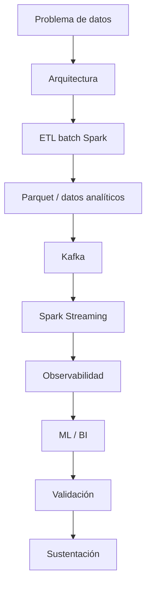

# Proyecto Sello de Big Data

## 1. Propósito

El Proyecto Sello integra las sesiones de **Big Data** alrededor de una solución distribuida end-to-end. El curso parte de una arquitectura de datos y culmina en un sistema que procesa datos batch y streaming, genera salidas analíticas o ML, incorpora observabilidad y demuestra valor para la toma de decisiones.

### Competencia o capacidad del proyecto

Al finalizar el Proyecto Sello, el estudiante demuestra que puede construir y defender una solución Big Data distribuida, aplicando arquitectura de datos, procesamiento batch, almacenamiento analítico, streaming, observabilidad, reproducibilidad, salidas BI/ML, validación de resultados y sustentación integral de la solución.

### Competencias relacionadas

| Código | Competencia | Relación con el proyecto |
|---|---|---|
| CE022 | Ingeniería de la Información | Evidencia diseño, procesamiento, administración y uso de datasets para análisis y toma de decisiones. |
| CE023 | Programación | Evidencia implementación de pipelines batch/streaming, integración técnica y salidas analíticas o ML. |
| CE024 | Calidad de Software | Evidencia reproducibilidad, observabilidad, validación, documentación, repositorio y sustentación integral. |

```text
Arquitectura -> Batch -> Almacenamiento -> Streaming -> Observabilidad -> ML/BI -> Integración -> Sustentación
```

## 2. El Proyecto

Durante el semestre desarrollarás un **sistema Big Data distribuido end-to-end** con procesamiento batch, procesamiento streaming, analítica/ML, observabilidad y visualización o salida para decisiones.

El proyecto debe ejecutarse de forma reproducible en el laboratorio, trabajar con datos representativos, generar evidencias de ejecución y explicar el valor analítico del procesamiento realizado.

No se considera Proyecto Sello:

- Notebooks aislados sin flujo común.
- Transformaciones Spark sin problema analítico.
- Streaming que solo consume mensajes sin generar salida útil.
- Modelos ML sin evaluación ni reutilización.
- Métricas técnicas sin interpretación.
- Una solución que el estudiante no pueda reproducir ni defender.

## 3. Evolución del Proyecto

| Unidad | Temas principales | Evolución del proyecto |
|---|---|---|
| Unidad 1 | Arquitectura Big Data, Spark, ETL batch, HDFS/formats y Parquet. | Pipeline batch distribuido con salidas analíticas preparadas. |
| Unidad 2 | Kafka, Spark Streaming, observabilidad, costos, ML distribuido, series de tiempo e inferencia. | Pipeline en tiempo real con salidas BI/ML y evidencias operacionales. |
| Unidad 3 | Integración, hardening, validación técnica y demo end-to-end. | Sistema Big Data final integrado y sustentado. |



### Alineamiento por sesiones

Este alineamiento muestra cómo el sistema Big Data crece desde procesamiento batch distribuido hasta integración streaming, observabilidad y analítica/ML.

| Sesiones | Contenido central | Avance del proyecto |
|---|---|---|
| S1-S2 | Arquitectura Big Data y fundamentos Spark. | Brief técnico-analítico, entorno reproducible y primeras transformaciones distribuidas. |
| S3-S4 | ETL distribuido, almacenamiento, HDFS/formats y Parquet. | Pipeline batch con datos transformados, validados y almacenados para consumo analítico. |
| S5 | Evaluación U1. | Producto U1: pipeline batch distribuido sustentado. |
| S6-S7 | Ingesta Kafka y procesamiento streaming con Spark. | Flujo de eventos consumido y procesado en tiempo real. |
| S8 | Observabilidad y costos. | Métricas, paneles o evidencias operacionales del pipeline. |
| S9-S11 | ML distribuido, inferencia, series de tiempo y tuning. | Modelo entrenado, evaluado, guardado, reutilizado y mejorado con experimentación. |
| S12 | Evaluación U2. | Producto U2: pipeline streaming con salida BI/ML y evidencias. |
| S13-S15 | Integración, revisión técnica y sustentación final. | Sistema Big Data end-to-end integrado, validado y defendido. |
| S16 | Evaluación final. | Recuperación de competencias pendientes y cierre técnico. |

## 4. Cronograma

| Hito | Momento | Producto esperado |
|---|---|---|
| S2 | Brief técnico-analítico | Problema de datos, fuentes, arquitectura, salidas esperadas y alcance. |
| S5 | Producto U1 | Pipeline batch distribuido con datos transformados, validados y almacenados en formato analítico. |
| S12 | Producto U2 | Pipeline streaming con Kafka/Spark, observabilidad, costos y salida BI/ML o inferencia. |
| S15 | Producto final | Sistema Big Data end-to-end integrado, validado y sustentado con demo reproducible. |
| S16 | Cierre individual | Evaluación final o recuperación de competencias pendientes. |

## 5. Producto Final

### Repositorio académico y topics

Desde la primera presentación del proyecto, el repositorio debe estar creado y configurado con los topics académicos mínimos. Esta configuración es obligatoria porque permite identificar campus, semestre, línea, tipo de proyecto, curso, sección y grupo.

El detalle oficial del estándar se encuentra en [Estándar transversal de topics para repositorios académicos](https://upeuoficial.github.io/planb/anexos/estandar-topics-repositorios/).

Ejemplo base para Big Data:

```text
campus-juliaca
semestre-2026-2
linea-cdia
tipo-ps
bigdata
seccion-g1
grupo-<numero>-<nombre-proyecto>
```

Componentes mínimos:

- Problema de datos delimitado.
- Arquitectura técnica del flujo.
- Dataset o fuente de eventos representativa.
- Pipeline batch con Spark.
- Transformaciones y validación básica de calidad.
- Salida analítica en formato eficiente, como Parquet.
- Ingesta o simulación de eventos con Kafka.
- Procesamiento streaming con Spark Structured Streaming.
- Evidencia de observabilidad técnica.
- Métricas de rendimiento, costos o comportamiento operacional.
- Modelo ML, inferencia, salida BI o análisis distribuido según alcance.
- Evidencias reproducibles de ejecución.
- Documentación técnica y demo final.

## 6. Evaluación por competencias

Los criterios se organizan según una matriz común de evaluación de proyectos académicos: problema, arquitectura, implementación, datos, integración y calidad, validación y sustentación. Cada criterio se adapta al enfoque de Big Data y se verifica mediante evidencias del producto, el repositorio y la demostración.

| Dimensión común | Criterio del PS | Capacidad evaluada | Evidencias esperadas |
|---|---|---|---|
| 1. Problema y alcance | Problema y alcance de datos | Formula una necesidad como problema de datos viable y delimitado. | Problema, fuentes, alcance, usuarios, resultados esperados y restricciones. |
| 2. Requerimientos o funcionalidad esperada | Resultados analíticos esperados | Define salidas analíticas o inteligentes alineadas al problema. | Salidas batch, streaming, BI o ML, criterios de aceptación y ejemplos de uso. |
| 3. Diseño, modelo o arquitectura | Arquitectura Big Data | Diseña una arquitectura distribuida para ingesta, procesamiento, almacenamiento y consumo. | Diagrama de arquitectura, componentes, flujo de datos, herramientas y decisiones. |
| 4. Implementación técnica | Procesamiento batch y streaming | Implementa procesamiento distribuido reproducible para datos históricos y eventos. | Notebooks, jobs Spark, streaming, salidas generadas, pruebas o capturas de ejecución. |
| 5. Datos, persistencia o procesamiento | Almacenamiento analítico | Organiza datos y salidas para análisis posterior y consumo confiable. | Datasets, formatos, particiones o carpetas, evidencias de almacenamiento y lectura. |
| 6. Integración del producto y calidad técnica | Integración analítica y calidad técnica | Integra batch, streaming, observabilidad y analítica como un flujo común, reproducible y documentado. | Demo o evidencias end-to-end, trazabilidad entre componentes, comandos, entorno, logs, métricas y documentación. |
| 7. Validación, pruebas o resultados | BI/ML distribuido | Valida resultados analíticos, inferencias o salidas BI con valor para decisiones. | Métricas, resultados, análisis, salidas BI/ML, validaciones y conclusiones. |
| 8. Sustentación técnica y profesional | Sustentación integral | Defiende técnica y profesionalmente la solución Big Data, evidenciando autoría, comprensión y responsabilidad académica. | Pitch, demo end-to-end, defensa técnica, aporte individual, repositorio, topics y MkDocs o equivalente. |

### Rúbrica

| Criterios | % | A (20) | B (15) | C (10) | D (5) |
|---|---:|---|---|---|---|
| 1. Problema y alcance | 10% | Problema claro, viable y bien delimitado; el alcance responde al contexto y está justificado. | Problema y alcance comprensibles, con algunos límites o justificaciones por precisar. | Problema poco delimitado o alcance parcialmente viable. | Problema confuso, sin alcance definido o sin relación clara con el producto. |
| 2. Requerimientos o funcionalidad esperada | 10% | Funcionalidades o requerimientos completos, coherentes y verificables según la necesidad planteada. | Funcionalidades principales cubiertas, con detalles menores pendientes o poco precisos. | Funcionalidades incompletas o parcialmente alineadas al problema. | Funcionalidades ausentes, inconexas o sin relación verificable con la necesidad. |
| 3. Diseño, modelo o arquitectura | 10% | Diseño, modelo o arquitectura coherente, aplicado y alineado al producto; muestra estructura y decisiones claras. | Diseño funcional con limitaciones menores o decisiones parcialmente justificadas. | Diseño poco claro, incompleto o aplicado de forma parcial. | No presenta diseño, modelo o arquitectura verificable. |
| 4. Implementación técnica | 10% | Implementación correcta, funcional y alineada a los contenidos centrales del curso. | Implementación funcional con detalles técnicos menores por corregir. | Implementación parcial, con errores o uso limitado de los contenidos del curso. | Implementación insuficiente, no funcional o no relacionada con los contenidos del curso. |
| 5. Datos, persistencia o procesamiento | 10% | Los datos se gestionan, almacenan, consultan o procesan correctamente según el tipo de proyecto. | Gestión de datos funcional con detalles menores de consistencia, estructura o procesamiento. | Gestión de datos parcial, limitada o con errores relevantes. | No hay manejo de datos verificable o este impide el funcionamiento del producto. |
| 6. Integración del producto y calidad técnica | 10% | El producto funciona como sistema integrado, ordenado, documentado y reproducible. | Integración funcional con detalles menores de organización, documentación o reproducibilidad. | Integración parcial; existen componentes aislados, desorden o evidencias incompletas. | Componentes desconectados, sin organización técnica ni evidencia reproducible. |
| 7. Validación, pruebas o resultados | 10% | Presenta pruebas, evidencias o resultados claros que comprueban el funcionamiento y el valor del producto. | Presenta evidencias suficientes, con algunos casos o resultados por completar. | Evidencias limitadas, poco claras o con validación parcial. | No presenta pruebas, evidencias ni resultados verificables. |
| 8. Sustentación técnica y profesional | 30% | Explica y defiende el producto con solvencia; demuestra aporte individual, dominio técnico, comunicación clara, repositorio, documentación y actitud profesional. | Sustentación clara y funcional, con detalles menores en defensa técnica, evidencias, comunicación o documentación. | Sustentación parcial; dominio, evidencias, comunicación o aporte individual insuficientemente demostrados. | No sustenta adecuadamente, no demuestra autoría o no presenta evidencias mínimas del producto. |

### Subaspectos de la sustentación integral

La sustentación integral debe representar como mínimo el 30% de la evaluación del proyecto. Se revisa mediante los siguientes subaspectos:

| Subaspecto | Qué observa |
|---|---|
| 1. Defensa técnica | Explicación del problema, arquitectura, flujo batch/streaming, decisiones técnicas, validaciones, resultados, limitaciones y evidencias generadas. |
| 2. Comunicación y orden | Claridad, estructura, tiempo y lenguaje técnico. |
| 3. Presentación personal y actitud | Puntualidad, vestimenta limpia y adecuada, higiene, cabello ordenado, actitud profesional, respeto, honestidad y coherencia con los valores y principios cristianos de la institución. |
| 4. Aporte individual | Cada integrante demuestra lo que hizo. |
| 5. Repositorio y estándares | Topics, organización, commits, documentación y reproducibilidad. |
| 6. MkDocs o equivalente | Documentación publicada, navegable y alineada al producto. |
| 7. Pitch/demo ejecutiva | Introducción clara del problema, solución y valor, seguida de una demo funcional. |

La sustentación profesional forma parte de la evaluación porque el producto final no solo debe funcionar; también debe ser presentado, explicado y defendido con responsabilidad académica, ética, respeto, honestidad y coherencia con los valores y principios cristianos de la institución.

## 7. Sustentación

La sustentación inicia con un video pitch breve o introducción ejecutiva de 1 a 3 minutos para presentar el problema, la solución, el valor del producto y la participación del equipo o estudiante.

| Momento | Tiempo sugerido | Propósito |
|---|---:|---|
| Exposición técnica | 10 minutos | Presentar problema, arquitectura, fuentes, pipelines, observabilidad, resultados y valor analítico. |
| Demostración end-to-end | 5 minutos | Ejecutar o evidenciar el flujo batch/streaming, salidas generadas, métricas y resultados BI/ML. |

Cada integrante debe demostrar una parte verificable: arquitectura, Spark batch, Kafka, streaming, observabilidad, ML/BI, validación, documentación o pruebas. La demo debe mostrar ejecución o evidencias reproducibles, no solo explicación conceptual.

## 8. Resultado Esperado

Al finalizar el curso, el estudiante debe demostrar que puede construir una solución Big Data distribuida, observable y orientada a decisiones.

```text
Datos -> Procesamiento distribuido -> Streaming -> Observabilidad -> Analítica/ML -> Decisión -> Sustentación
```

## Anexo. Secuencia sugerida de presentación

La presentación puede organizarse con una secuencia breve de apoyo visual. El video pitch o introducción ejecutiva abre la sustentación y no reemplaza la demo ni la defensa técnica.

| Orden | Slide o momento | Propósito | Competencia evidenciada |
|---:|---|---|---|
| 1 | Título del proyecto y equipo | Identificar el proyecto, integrantes y dominio elegido. | CE024 |
| 2 | Video pitch o introducción ejecutiva | Presentar problema, solución, valor y participación del equipo. | CE024 |
| 3 | Problema de datos | Explicar la necesidad analítica y el alcance. | CE022 |
| 4 | Arquitectura Big Data | Mostrar ingesta, procesamiento, almacenamiento, consumo y observabilidad. | CE022 + CE023 |
| 5 | Datos y almacenamiento | Presentar fuentes, formatos, salidas y organización analítica. | CE022 |
| 6 | Procesamiento batch | Explicar pipeline Spark, transformaciones y validaciones. | CE022 + CE023 |
| 7 | Streaming | Mostrar flujo de eventos, procesamiento y resultados. | CE023 |
| 8 | Observabilidad y reproducibilidad | Presentar comandos, notebooks, métricas, logs o paneles. | CE024 |
| 9 | Resultados BI/ML | Mostrar análisis, inferencia, modelo o salida para decisiones. | CE022 |
| 10 | Demo end-to-end | Evidenciar ejecución o flujo completo del sistema. | CE023 + CE024 |
| 11 | 4. Aporte individual | Indicar qué hizo cada integrante. | CE024 |
| 12 | Repositorio, estándares y mejoras | Mostrar topics, documentación publicada en MkDocs o equivalente, reproducibilidad, límites y mejora. | CE024 |

## Anexo. Plantilla mínima de documentación MkDocs o equivalente

La documentación publicada no reemplaza al informe. Su función es permitir que otra persona comprenda, ejecute, revise y verifique el producto desde el repositorio.

| Página o sección | Contenido mínimo | Evidencia esperada |
|---|---|---|
| Inicio | Nombre del proyecto, problema, solución, curso o cursos, integrantes y enlace al repositorio. | Presentación clara del producto. |
| Instalación o ejecución | Requisitos, dependencias, configuración y comandos para ejecutar el proyecto. | Instrucciones reproducibles. |
| Uso del sistema | Flujo principal, pantallas, comandos, endpoints, notebooks o casos de uso según corresponda. | Guía breve para probar el producto. |
| Arquitectura o estructura | Diagrama, componentes, carpetas principales y decisiones técnicas. | Vista técnica comprensible. |
| Módulos o funcionalidades | Descripción de las funciones principales del producto. | Relación entre funcionalidades y problema. |
| Datos | Modelo, archivos, base de datos, datasets, fuentes o estructura de almacenamiento según el curso. | Evidencia de gestión de datos. |
| Pruebas y evidencias | Casos de prueba, capturas, resultados, métricas, validaciones o salidas generadas. | Verificación del funcionamiento. |
| Equipo y aporte individual | Integrantes, responsabilidades, aportes y evidencias de participación. | Autoría verificable. |
| 5. Repositorio y estándares | Topics académicos, estructura, commits, ramas si aplica y criterios de reproducibilidad. | Cumplimiento de estándares técnicos. |
| Limitaciones y mejoras | Restricciones del producto y mejoras futuras priorizadas. | Cierre reflexivo y realista. |

La documentación debe estar disponible desde las primeras presentaciones y crecer con el proyecto. Para FP puede ser una documentación sencilla; para proyectos integradores y cursos avanzados debe ser más completa y técnica.
## Anexo. Plantilla sugerida de informe del proyecto

El informe debe documentar el producto de manera breve, verificable y alineada a las competencias evaluadas. No reemplaza la demo ni la sustentación; organiza las evidencias del proyecto.

| Sección | Contenido mínimo | Evidencia esperada |
|---|---|---|
| Portada | Nombre del proyecto, curso, sección, integrantes, docente y semestre. | Datos completos del equipo. |
| Resumen del proyecto | Problema de datos, solución Big Data y valor analítico. | Síntesis de 8 a 12 líneas. |
| Competencia y alcance | Competencia/capacidad del proyecto y competencias relacionadas. | CE022, CE023 y CE024 vinculadas al producto. |
| Problema y datos | Necesidad analítica, fuentes, alcance y restricciones. | Descripción del problema y dataset. |
| Arquitectura Big Data | Componentes de ingesta, procesamiento, almacenamiento, consumo y observabilidad. | Diagrama y decisiones técnicas. |
| Procesamiento batch | Jobs, transformaciones, validaciones y salidas. | Notebooks, comandos, salidas y capturas. |
| Streaming | Flujo de eventos, procesamiento y resultados. | Evidencias de ejecución o simulación. |
| Almacenamiento y resultados | Formatos, datasets generados, salidas BI/ML o inferencias. | Archivos, métricas, tablas o visualizaciones. |
| Observabilidad y reproducibilidad | Logs, métricas, comandos, entorno y forma de ejecución. | Capturas, instrucciones y resultados reproducibles. |
| Repositorio y documentación | Repositorio, topics, estructura, notebooks y documentación publicada. | URL del repositorio y MkDocs o equivalente. |
| 4. Aporte individual | Responsabilidad de cada integrante. | Tabla de tareas, commits o evidencias por integrante. |
| Limitaciones y mejoras | Límites técnicos y mejoras posibles. | Lista priorizada y realista. |


