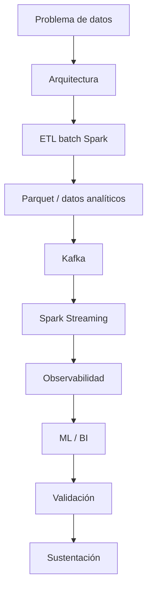

# Proyecto Sello de Big Data

## 1. Propósito

El Proyecto Sello integra las sesiones de **Big Data** alrededor de una solución distribuida end-to-end. El curso parte de una arquitectura de datos y culmina en un sistema que procesa datos batch y streaming, genera salidas analíticas o ML, incorpora observabilidad y demuestra valor para la toma de decisiones.

```text
Arquitectura -> Batch -> Almacenamiento -> Streaming -> Observabilidad -> ML/BI -> Integración -> Sustentación
```

## 2. El Proyecto

Durante el semestre desarrollarás un **sistema Big Data distribuido end-to-end** con procesamiento batch, procesamiento streaming, analítica/ML, observabilidad y visualización o salida para decisiones.

El proyecto debe ejecutarse de forma reproducible en el laboratorio, trabajar con datos representativos, generar evidencias de ejecución y explicar el valor analítico del procesamiento realizado.

No se considera Proyecto Sello:

- Notebooks aislados sin flujo común.
- Transformaciones Spark sin problema analítico.
- Streaming que solo consume mensajes sin generar salida útil.
- Modelos ML sin evaluación ni reutilización.
- Métricas técnicas sin interpretación.
- Una solución que el estudiante no pueda reproducir ni defender.

## 3. Evolución del Proyecto

| Unidad | Temas principales | Evolución del proyecto |
|---|---|---|
| Unidad 1 | Arquitectura Big Data, Spark, ETL batch, HDFS/formats y Parquet. | Pipeline batch distribuido con salidas analíticas preparadas. |
| Unidad 2 | Kafka, Spark Streaming, observabilidad, costos, ML distribuido, series de tiempo e inferencia. | Pipeline en tiempo real con salidas BI/ML y evidencias operacionales. |
| Unidad 3 | Integración, hardening, validación técnica y demo end-to-end. | Sistema Big Data final integrado y sustentado. |



### Alineamiento por sesiones

Este alineamiento muestra cómo el sistema Big Data crece desde procesamiento batch distribuido hasta integración streaming, observabilidad y analítica/ML.

| Sesiones | Contenido central | Avance del proyecto |
|---|---|---|
| S1-S2 | Arquitectura Big Data y fundamentos Spark. | Brief técnico-analítico, entorno reproducible y primeras transformaciones distribuidas. |
| S3-S4 | ETL distribuido, almacenamiento, HDFS/formats y Parquet. | Pipeline batch con datos transformados, validados y almacenados para consumo analítico. |
| S5 | Evaluación U1. | Producto U1: pipeline batch distribuido sustentado. |
| S6-S7 | Ingesta Kafka y procesamiento streaming con Spark. | Flujo de eventos consumido y procesado en tiempo real. |
| S8 | Observabilidad y costos. | Métricas, paneles o evidencias operacionales del pipeline. |
| S9-S11 | ML distribuido, inferencia, series de tiempo y tuning. | Modelo entrenado, evaluado, guardado, reutilizado y mejorado con experimentación. |
| S12 | Evaluación U2. | Producto U2: pipeline streaming con salida BI/ML y evidencias. |
| S13-S15 | Integración, revisión técnica y sustentación final. | Sistema Big Data end-to-end integrado, validado y defendido. |
| S16 | Evaluación final. | Recuperación de competencias pendientes y cierre técnico. |

## 4. Cronograma

| Hito | Momento | Producto esperado |
|---|---|---|
| S2 | Brief técnico-analítico | Problema de datos, fuentes, arquitectura, salidas esperadas y alcance. |
| S5 | Producto U1 | Pipeline batch distribuido con datos transformados, validados y almacenados en formato analítico. |
| S12 | Producto U2 | Pipeline streaming con Kafka/Spark, observabilidad, costos y salida BI/ML o inferencia. |
| S15 | Producto final | Sistema Big Data end-to-end integrado, validado y sustentado con demo reproducible. |
| S16 | Cierre individual | Evaluación final o recuperación de competencias pendientes. |

## 5. Producto Final

### Repositorio académico y topics

Desde la primera presentación del proyecto, el repositorio debe estar creado y configurado con los topics académicos mínimos. Esta configuración es obligatoria porque permite identificar campus, semestre, línea, tipo de proyecto, curso, sección y grupo.

El detalle oficial del estándar se encuentra en [Estándar transversal de topics para repositorios académicos](https://upeuoficial.github.io/planb/anexos/estandar-topics-repositorios/).

Ejemplo base para Big Data:

```text
campus-juliaca
semestre-2026-2
linea-cdia
tipo-ps
bigdata
seccion-g1
grupo-<numero>-<nombre-proyecto>
```

Componentes mínimos:

- Problema de datos delimitado.
- Arquitectura técnica del flujo.
- Dataset o fuente de eventos representativa.
- Pipeline batch con Spark.
- Transformaciones y validación básica de calidad.
- Salida analítica en formato eficiente, como Parquet.
- Ingesta o simulación de eventos con Kafka.
- Procesamiento streaming con Spark Structured Streaming.
- Evidencia de observabilidad técnica.
- Métricas de rendimiento, costos o comportamiento operacional.
- Modelo ML, inferencia, salida BI o análisis distribuido según alcance.
- Evidencias reproducibles de ejecución.
- Documentación técnica y demo final.

## 6. Evaluación

Los criterios se organizan según una matriz común de evaluación de proyectos académicos: problema, arquitectura, implementación, datos, integración, calidad, validación y sustentación. Cada criterio se adapta al enfoque de Big Data y se verifica mediante evidencias del producto, el repositorio y la demostración.

| Dimensión común | Criterio del PS | Qué se observa |
|---|---|---|
| Problema y alcance | Problema y alcance de datos | El proyecto responde a una necesidad de datos clara, viable y bien delimitada. |
| Requerimientos o funcionalidad esperada | Resultados analíticos esperados | El producto define salidas batch, streaming, BI o ML que responden al problema planteado. |
| Diseño, modelo o arquitectura | Arquitectura Big Data | La solución define una arquitectura distribuida coherente para ingesta, procesamiento, almacenamiento y consumo. |
| Implementación técnica | Procesamiento batch y streaming | El pipeline Spark transforma, valida y almacena datos, y el flujo streaming consume, procesa y produce resultados útiles con evidencias verificables. |
| Datos, persistencia o procesamiento | Almacenamiento analítico | Las salidas están organizadas en formatos adecuados para análisis posterior y cuentan con evidencia revisable. |
| Integración del producto | Integración analítica | Batch, streaming, observabilidad y analítica forman un flujo común, no piezas aisladas. |
| Calidad técnica | Reproducibilidad y observabilidad | El entorno, comandos, notebooks, métricas, logs o paneles permiten volver a ejecutar y diagnosticar la solución. |
| Validación, pruebas o resultados | BI/ML distribuido | El proyecto genera análisis, inferencia, modelo o salida BI con valor para decisiones y resultados verificables. |
| Sustentación técnica y profesional | Sustentación integral | Se evalúa mediante subaspectos de defensa técnica, comunicación, presentación personal, aporte individual, repositorio, documentación publicada y pitch/demo ejecutiva. |

### Subaspectos de la sustentación integral

La sustentación integral debe representar como mínimo el 30% de la evaluación del proyecto. Se revisa mediante los siguientes subaspectos:

| Subaspecto | Qué observa |
|---|---|
| Defensa técnica | Explicación del problema, arquitectura, flujo batch/streaming, decisiones técnicas, validaciones, resultados, limitaciones y evidencias generadas. |
| Comunicación y orden | Claridad, estructura, tiempo y lenguaje técnico. |
| Presentación personal y actitud | Puntualidad, vestimenta limpia y adecuada, higiene, cabello ordenado y actitud profesional. |
| Aporte individual | Cada integrante demuestra lo que hizo. |
| Repositorio y estándares | Topics, organización, commits, documentación y reproducibilidad. |
| MkDocs o equivalente | Documentación publicada, navegable y alineada al producto. |
| Pitch/demo ejecutiva | Introducción clara del problema, solución y valor, seguida de una demo funcional. |

## 7. Sustentación

La sustentación inicia con un video pitch breve o introducción ejecutiva de 1 a 3 minutos para presentar el problema, la solución, el valor del producto y la participación del equipo o estudiante.

| Momento | Tiempo sugerido | Propósito |
|---|---:|---|
| Exposición técnica | 10 minutos | Presentar problema, arquitectura, fuentes, pipelines, observabilidad, resultados y valor analítico. |
| Demostración end-to-end | 5 minutos | Ejecutar o evidenciar el flujo batch/streaming, salidas generadas, métricas y resultados BI/ML. |

Cada integrante debe demostrar una parte verificable: arquitectura, Spark batch, Kafka, streaming, observabilidad, ML/BI, validación, documentación o pruebas. La demo debe mostrar ejecución o evidencias reproducibles, no solo explicación conceptual.

## 8. Resultado Esperado

Al finalizar el curso, el estudiante debe demostrar que puede construir una solución Big Data distribuida, observable y orientada a decisiones.

```text
Datos -> Procesamiento distribuido -> Streaming -> Observabilidad -> Analítica/ML -> Decisión -> Sustentación
```

## Anexo. Secuencia sugerida de presentación

La presentación puede organizarse con una secuencia breve de apoyo visual. El video pitch o introducción ejecutiva abre la sustentación y no reemplaza la demo ni la defensa técnica.

| Orden | Slide o momento | Propósito |
|---:|---|---|
| 1 | Título del proyecto y equipo | Identificar el proyecto, integrantes y dominio elegido. |
| 2 | Video pitch o introducción ejecutiva | Presentar problema, solución, valor y participación del equipo. |
| 3 | Problema de datos | Explicar la necesidad analítica y el alcance. |
| 4 | Arquitectura Big Data | Mostrar ingesta, procesamiento, almacenamiento, consumo y observabilidad. |
| 5 | Datos y almacenamiento | Presentar fuentes, formatos, salidas y organización analítica. |
| 6 | Procesamiento batch | Explicar pipeline Spark, transformaciones y validaciones. |
| 7 | Streaming | Mostrar flujo de eventos, procesamiento y resultados. |
| 8 | Observabilidad y reproducibilidad | Presentar comandos, notebooks, métricas, logs o paneles. |
| 9 | Resultados BI/ML | Mostrar análisis, inferencia, modelo o salida para decisiones. |
| 10 | Demo end-to-end | Evidenciar ejecución o flujo completo del sistema. |
| 11 | Aporte individual | Indicar qué hizo cada integrante. |
| 12 | Repositorio, estándares y mejoras | Mostrar topics, documentación publicada en MkDocs o equivalente, reproducibilidad, límites y mejora. |
